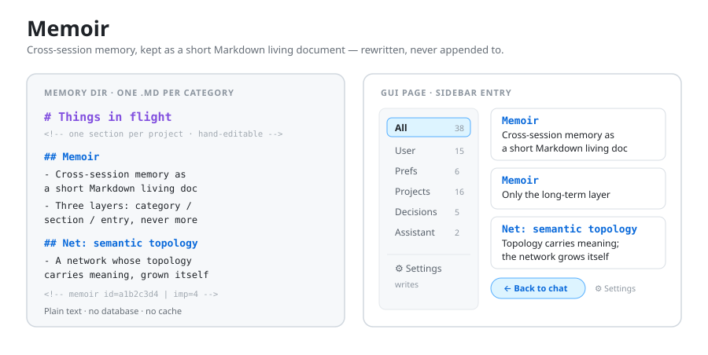
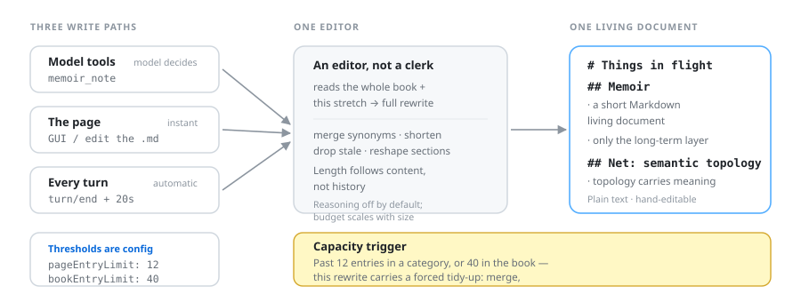

# Memoir

[简体中文](README.md) · [Français](README.fr.md) · [Deutsch](README.de.md) · [日本語](README.ja.md) · **English**

[](https://www.npmjs.com/package/@yansera/dsh-memoir)
[](https://github.com/Yansera/dsh-memoir/actions/workflows/ci.yml)
[](test/)
[](LICENSE)
[](package.json)

> **Cross-session memory for DeepSeek Harness, kept as a short, readable Markdown living document** — with a page of its own in the GUI.



---

## The problem it solves

Almost every AI memory project is solving **"how do we remember more, and retrieve it better?"**

Memoir goes the other way. It solves exactly one thing: **keeping the memory short enough that someone actually reads it.**

One memory is one sentence. The whole book takes under two minutes to read. It doesn't grow with every turn of conversation — because it is **rewritten**, not **appended to**.

---

## ✨ How it's different

| | The usual approach | Memoir |
|---|---|---|
| **Growth** | Only ever grows; a human has to prune it | **Rewritten in full every turn**: merge, shorten, delete, add. Length follows content, not history |
| **Model's role** | A clerk — append a line when something new shows up | An **editor** — reread everything and hand back a better version |
| **Structure** | A flat list, or categories hard-coded in the source | **Three layers**: category → section → entry. Both categories and sections are created and dropped by the model, by topic |
| **Data** | A database, a vector store, a private format | **Plain Markdown files.** Open them in any editor, edit by hand, put them in version control |
| **Size control** | Errors out when it's full | **Capacity trigger**: past 12 entries in a category or 40 in the book, a forced tidy-up is issued |
| **Turning it off** | Uninstall it | One **write switch** in the page. Off means nothing is read and nothing is written |

In one line: **other projects work on what to remember; this one works on making it readable.**

---

## 🚀 Quick start

### 1. Install

```sh
dsh plugin --profile desktop add @yansera/dsh-memoir
```

> Replace `desktop` with your profile name (usually `web` on the web build).
> `dsh` ships with DeepSeek Harness — on the desktop client it lives at `<install dir>\resources\runtime\cli\bin\dsh.cmd`.

**From source** (for development):

```sh
dsh plugin --profile desktop add 'file:D:\path\to\dsh-memoir'
```

### 2. Restart the client

**This step is not optional.** DSH loads plugin code **at install time only**; editing files afterwards changes nothing. Closing the window is not quitting — fully exit and start it again.

### 3. Open it

A **Memoir** icon appears in the sidebar. Click it and the main area becomes the memory page — categories on the left, entries on the right. **"← Back to chat"** in the top-left takes you back at any time.

### 4. Use it

Nothing to configure. From here on:

- **The model writes by itself** — when you state a lasting preference, settle a decision, or correct it, it calls `memoir_note`
- **You can write too** — click "New entry", or **edit the Markdown files** under `$DSH_HOME/memoir/` directly (refresh the page and they show up)
- **Every turn tidies up** — 20 seconds after a turn goes quiet, the background rereads the whole book and rewrites it

**Want it to stop?** Top-right **⚙** → turn off **Memory writes**. Nothing is read, nothing is written, nothing changes on disk.

---

## 🧱 Three layers, never more

```
# Things in flight                ← layer 1: category. Structure and count follow the content

<!-- projects, current stage · editable by hand -->

## Memoir                         ← layer 2: section. One per project or topic

- Keeps cross-session memory as a short Markdown living document    ← layer 3: entry
  <!-- memoir id=a1b2c3d4 | imp=4 | at=2026-10-07 | src=auto -->

## Net: semantic topology

- Grow a network whose topology carries meaning, by mutation and selection
```

| Layer | Syntax | Decided by |
|---|---|---|
| **Category** | one `.md` file | the model, by topic — there is no hard-coded list |
| **Section** | `## Project` | everything about one project goes under it; skip when it doesn't fit |
| **Entry** | `- one sentence` | the end of the line — nothing deeper |

**Why organise by topic instead of by kind?** Because when you look something up, you think *"which project was that?"*, not *"was that a decision or a status update?"*. Organising by kind scatters one project across several drawers.

Five categories are seeded on first run: **About the user · Preferences & rules · Things in flight · Decisions · About the assistant**. They're just a starting point — delete what you don't want.

---

## ✍️ Three write paths, one living document



| Path | Triggered by | Who writes |
|---|---|---|
| **Model tools** | the model decides something is worth keeping | `memoir_note` / `memoir_recall` / `memoir_forget` |
| **The page** | you click "New entry", or edit the Markdown | you |
| **Automatic rewrite** | end of every turn | the model rereads and hands back a full rewrite |

> The first two **append**. The third **rewrites**. That third one is the whole point — it's what stops the document from only ever growing.

---

## 🔄 The automatic rewrite

Once a turn goes quiet (20 seconds by default), the background **rewrites the entire book**:

> The model receives *the whole book as it stands* plus *this stretch of conversation*, and must return **the complete rewritten version** — anything to merge, merge it; anything stale, shorten it; anything dead, drop it; anything new, add it. Categories and sections can change shape too.

So it behaves like an **editor** maintaining a living document, not a clerk appending to a log.

**Guard rails:**

- **Per-session cursor** — only new events are consumed, so a stretch is never rewritten twice
- **Failure doesn't advance the cursor** — the next turn retries the same stretch
- **Too little content is skipped** (400 characters by default), but the cursor still advances
- **Globally serialised** — when several sessions wrap up at once the requests queue instead of piling on
- **Two safety nets**: if no categories can be parsed, nothing is written; if the entry count drops by more than half (when there were at least 6), the whole rewrite is rejected and the file is left alone

If no `llm` service is available (no model configured on the host), the whole path is skipped silently and the tools and page keep working.

### Capacity trigger

A rewrite alone isn't enough — on its own it only makes small corrections while the count keeps climbing. So there are two thresholds:

| Threshold | Default | Meaning |
|---|---|---|
| `pageEntryLimit` | 12 | entries in a single category |
| `bookEntryLimit` | 40 | entries in the whole book |

**Cross either one** and this rewrite also carries a **forced tidy-up order** stating exactly how many entries there are and which categories are over, and demanding three things:

1. **Merge** — fold synonyms and closely related entries into one sentence
2. **Shorten** — compress wordy entries down to the conclusion
3. **Add sections** — split an overfull category with `##` instead of leaving twenty entries flat

**When nothing is over the line, none of this is added** and the rewrite stays light.

---

## ⚙️ Settings

Top-right **⚙** in the page.

### Write switch

Off means **nothing is read and nothing is written**:

- memory is no longer injected into the system prompt
- all three tools refuse to run
- writes from the page and the HTTP API return 403
- the automatic rewrite stops

Handy for "don't record this conversation" — much lighter than uninstalling.

### Which model does the rewriting

The first dropdown **lists every model your host has already registered** — pick one and the two fields below fill themselves in.

**You don't need to know provider or model names.** The list comes from the host's:

```ts
ctx.llm.listProviders()          // every registered provider
ctx.llm.listModels(provider)     // the models under each one
```

So whatever you want to use — as long as it's **wired into DSH** — it shows up there:

- **Built into DSH** — e.g. `deepseek-flash` under `deepseek-official`
- **A local model** — whatever local inference server you connected to DSH (Ollama, llama.cpp, …)
- **A third-party API** — any OpenAI-compatible endpoint configured as a provider in DSH

| Field | Meaning |
|---|---|
| **Provider** | empty = follow the agent's default; or pick from the dropdown |
| **Model** | empty = follow the default; or pick from the dropdown |
| **Reasoning effort** | `off` / `low` / `high` / `max` / `don't send` |

Two **hand-typed** fields remain below the dropdown, for anything the host doesn't list (a dynamically generated model id, say). **Both routes work.**

> The plugin **makes no network requests of its own**; everything goes through the host's `llm` capability. So what you can choose depends on what you've connected to DSH. If the host has nothing registered, the dropdown says so instead of sitting blank.

**Why is reasoning off by default?** Rewriting is **tidying**, not **problem solving**. We measured it: a thinking model burns the output budget on reasoning and then has nothing left for the actual text — which shows up as "request succeeded but not a single text block came back". Turning it off gives the whole budget to the text.
---

## 🌍 Two separate languages

These are **two different switches**, and people tend to assume they're one:

| | What it controls | Default |
|---|---|---|
| **Interface language** | buttons, labels, hints — the **UI text** | `en` (English) |
| **Memory language** | **the words written into the md files**, category and section names included | `en` (English) |

### Interface language

**简体中文 · English · Français · Deutsch · 日本語**

- **English by default** (this ships publicly)
- You can also pick **Follow the host** — whatever language DSH uses
- Switching happens **entirely in the browser**: no restart, no round trip to the server

### Memory language

Once set, the rewrite prompt gains one more line:

> 【语言】这份记忆册的内容一律用 X 写，分类名和小节名也是，不要混用其他语言。

**It does not affect the interface** — the UI keeps whatever language it had.

- **English by default**
- Pick **Unrestricted** and the line isn't sent at all, letting the model follow the conversation's language
- With no `llm` service this line can't take effect — rewriting never runs in that case
---

## 🔧 Configuration

Every deployment-varying knob lives in `cordis.patch.yml` (or an overlay in your profile). Nothing is hard-coded.

```yaml
- id: memoir
  name: '@yansera/dsh-memoir'
  config:
    memoryDir: ''              # empty = $DSH_HOME/memoir
    injectIndex: true          # inject the memory index into the system prompt
    maxInjectEntries: 12       # how many entries to inject at most
    autoDistill: true          # rewrite at the end of every turn
    distillDebounceMs: 20000   # quiet period before rewriting (ms)
    distillMinChars: 400       # skip when the new stretch is shorter than this
    distillMaxItems: 60        # book-wide entry ceiling, suggested to the model
    distillMaxTokens: 8000     # output budget floor (scales up with book size)
    distillReasoningEffort: off # rewriting needs no reasoning; save the budget for text
    memoryLanguage: ''       # language used for the saved text; empty = unrestricted
    pageEntryLimit: 12         # more than this in one category → forced tidy-up
    bookEntryLimit: 40         # more than this in the book → forced tidy-up
```

**Restart after changing configuration.** Same rule as code: hot reload only happens at install time.

### Settings you change in the UI

`cordis.patch.yml` holds **deployment-level** config; what you change under ⚙ is **runtime settings**, stored in `.settings.json` inside the memory dir — it travels with your memory data, survives profile switches, and isn't overwritten by plugin upgrades.

| Key | Default | Meaning |
|---|---|---|
| `enabled` | `true` | master write switch; off means neither read nor write |
| `distillProvider` | `""` | provider used for rewriting; empty follows the agent default |
| `distillModel` | `""` | model used for rewriting; empty follows the default |
| `distillReasoningEffort` | `""` | overrides the reasoning effort from config |
| `locale` | `"en"` | interface language; `""` = follow the host |
| `memoryLanguage` | `"en"` | memory content language; `""` = unrestricted |

**The defaults are English UI + English memory** (this ships publicly). But they **only apply when the file doesn't exist** — once it does, the file wins, so choosing "Follow the host" or "Unrestricted" is stored as an empty string and never overwritten by the defaults.

---

## 📂 Storage format

```
$DSH_HOME/memoir/          ← default; change it with memoryDir
├── .order                 ← category order, one id per line
├── .settings.json         ← settings changed in the page
├── user.md                ← one file = one category
└── ...
```

**No database, no index, no cache.** Every read and write goes straight to disk — the files are tiny, and the payoff is that hand-editing a file shows up on the next page refresh.

**Hand-editing rules:**

| Line | Meaning |
|---|---|
| `# Title` | the category's display name (header, skipped) |
| `## Section` | layer-two section; entries below it belong to it |
| `- text` | one memory |
| `  <!-- memoir … -->` | metadata for the entry above (can be omitted entirely) |
| lines indented 2+ spaces | continuation of the entry above |
| anything else (blank, prose, `###`) | formatting, ignored |

**Ids are derived from content**: if the text doesn't change, the id doesn't change. That's why a full rewrite never breaks your position in the page.

---

## ❓ FAQ

**Will it clash with other memory features in my setup?**
No. Memoir only handles the **long-term, high-level** layer — who the user is, who the assistant is, what's in flight, which big calls were made. Short-term and procedural content (technical details, pitfalls, progress logs) is out of scope and never written here. Its data lives in its own directory, with no reads or writes across systems.

**Why is there no technical detail in my book?**
On purpose. Technical detail buries the "About the user" card under twenty command lines and then nobody reads it. That belongs to another memory system.

**Do I need to restart after editing the Markdown?**
No. Reads happen live on every request; refresh the page and you'll see it.

**Does turning the write switch off lose data?**
No. It stops reading and writing; the files stay on disk exactly as they were, and turning it back on resumes.

**Does it make any network requests behind my back?**
No. Apart from the host's `llm` capability for rewriting, it makes no requests of its own, reads nothing outside the memory directory, and collects no telemetry.

**Will my memories be sent to a model provider?**
**Yes** — the memory index is injected into every model request, and a rewrite sends the whole book. So **never put passwords, tokens or private keys in your memory**. See [SECURITY.md](SECURITY.md).

---

## 🛠 Development

```sh
npm test                # all 247 offline tests
npm run test:store      # storage: parsing, dedupe, moves, search, truncation, inject text
npm run test:plugin     # host half: registrations, tool calls, system prompt, HTTP routes
npm run test:client     # browser half: renders the real bundle with a React stand-in
npm run test:distill    # rewrite: output parsing, debounce, cursor, retries, capacity trigger
```

Everything runs offline: no DSH host required, and no real profile is touched.

**After changing the source** (Windows):

```powershell
& .\scripts\sync.ps1
```

pnpm hardlinks `file:` dependencies, so editing the source breaks the link and the installed copy goes stale — sync, then restart the client.

**Layout:**

```
src/       implementation (index = host half, distill = rewrite, client = browser half)
test/      offline tests
docs/      design and format notes
scripts/   sync script, live smoke test
```

More detail in [CONTRIBUTING.md](CONTRIBUTING.md) and [docs/](docs/):
[design](docs/design.md) · [storage format](docs/storage-format.md) · [configuration](docs/configuration.md).

---

## 📄 License

[MIT](LICENSE) © Yansera
