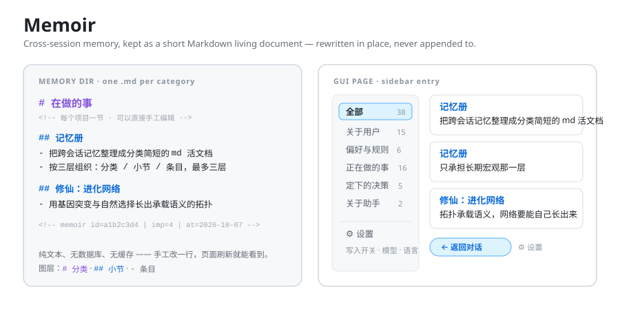
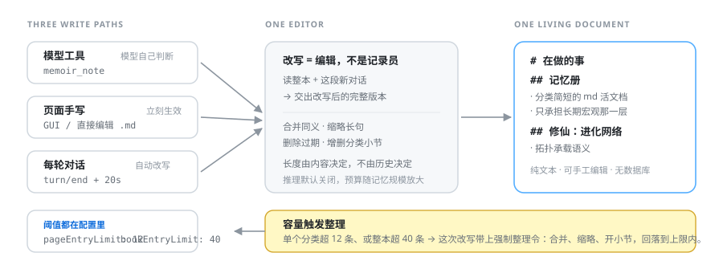

# Memoir（記憶帳）

[简体中文](README.md) · [English](README.en.md) · [Français](README.fr.md) · [Deutsch](README.de.md) · **日本語**

[](https://www.npmjs.com/package/@yansera/dsh-memoir)
[](https://github.com/Yansera/dsh-memoir/actions/workflows/ci.yml)
[](test/)
[](LICENSE)
[](package.json)

> **DeepSeek Harness のセッションをまたぐ記憶を、短くて読みやすい Markdown の生きた文書として保つ**——専用ページ付き。



---

## 何を解決するのか

ほとんどの AI 記憶プロジェクトは **「もっと覚え、もっと正確に引き出す」** に取り組んでいます。

Memoir は逆を行きます。解くのはただ一つ：**読みたくなる長さに記憶を保つこと**。

1 つの記憶は 1 文です。全部読んでも 2 分かかりません。会話が進むほど増えていきません——**書き換えられる**のであって、**追記される**のではないからです。

---

## ✨ 何が違うのか

| | よくあるやり方 | Memoir |
|---|---|---|
| **増え方** | 増える一方で、人間が削るしかない | **毎ターン全体を書き換え**：統合・短縮・削除・追加。長さは内容で決まり、履歴では決まらない |
| **モデルの役割** | 記録係——新しい話題が出たら 1 行足す | **編集者**——全体を読み直し、より良い版を返す |
| **構造** | 平坦なリスト、またはコードに固定されたカテゴリ | **3 階層**：カテゴリ → セクション → 項目。カテゴリもセクションもモデルが主題ごとに作り、消す |
| **データ** | データベース、ベクトル索引、独自形式 | **ただの Markdown ファイル。** どのエディタでも開け、手で編集でき、版管理にも入れられる |
| **大きさの制御** | 一杯になるとエラー | **容量トリガー**：1 カテゴリ 12 件、または全体 40 件を超えると強制整理が下る |
| **止めたいとき** | アンインストールするしかない | ページ上の**書き込みスイッチ**。オフなら読み書きとも一切しない |

ひとことで：**他は「何を覚えるか」を解いていて、これは「読めるようにする」を解いています。**

---

## 🚀 クイックスタート

### 1. インストール

```sh
dsh plugin --profile desktop add @yansera/dsh-memoir
```

> `desktop` は自分のプロファイル名に置き換えてください（Web 版は通常 `web`）。
> `dsh` は DeepSeek Harness に同梱されています。デスクトップ版では `<インストール先>\resources\runtime\cli\bin\dsh.cmd`。

**ソースから**（開発用）：

```sh
dsh plugin --profile desktop add 'file:D:\path\to\dsh-memoir'
```

### 2. クライアントを再起動

**この手順は省略できません。** DSH がプラグインのコードを読むのは**インストールした瞬間だけ**で、あとからファイルを変えても反映されません。ウィンドウを閉じただけでは終了していません——完全に終了してから起動し直してください。

### 3. 開く

サイドバーに **Memoir** のアイコンが出ます。クリックするとメイン領域がまるごと記憶帳になり、左がカテゴリ、右が項目です。左上の **「← 会話に戻る」** でいつでも戻れます。

### 4. 使う

設定は不要です。あとは：

- **モデルが自分で書きます**——長く効く好みを話したとき、決定を下したとき、訂正したときに `memoir_note` を呼びます
- **自分でも書けます**——「記録する」ボタン、または `$DSH_HOME/memoir/` の Markdown を**直接編集**（ページを更新すれば出ます）
- **毎ターン整理されます**——会話が静まって 20 秒後、背景が全体を読み直して書き換えます

**止めたいときは**：右上の **⚙** →「**記憶の書き込み**」をオフ。読み書きとも一切しなくなります。

---

## 🧱 3 階層、それ以上はなし

```
# 進行中のこと                  ← 第 1 層：カテゴリ。大きく、少なく

<!-- プロジェクト、現在の段階 · 手で編集可 -->

## Memoir                       ← 第 2 層：セクション。プロジェクトか主題ごとに 1 つ

- セッションをまたぐ記憶を短い Markdown の生きた文書として保つ    ← 第 3 層：項目
  <!-- memoir id=a1b2c3d4 | imp=4 | at=2026-10-07 | src=auto -->

## ネット：意味を担うトポロジー

- トポロジーが意味を担うネットワークを、突然変異と選択で育てる
```

| 層 | 書き方 | 決める人 |
|---|---|---|
| **カテゴリ** | `.md` ファイル 1 つ | モデルが主題ごとに。コードに固定リストはない |
| **セクション** | `## プロジェクト名` | 1 プロジェクトのことは全部その下へ。不要なら書かない |
| **項目** | `- 一文` | ここで終わり。それ以上は掘らない |

**なぜ「種類」ではなく「主題」で分けるのか。** 探すとき人は *「どのプロジェクトだったか」* を考えます。*「決定だったか進捗だったか」* とは考えません。種類で分けると、1 つのプロジェクトが複数の引き出しに散らばります。

初回起動時に 5 つのカテゴリが用意されます：**ユーザーについて · 好みとルール · 進行中のこと · 下した決定 · 助手について**。あくまで出発点です——要らないものは消してください。

---

## ✍️ 3 つの書き込み経路、1 つの生きた文書



| 経路 | きっかけ | 書く人 |
|---|---|---|
| **モデルのツール** | 残す価値があるとモデルが判断 | `memoir_note` / `memoir_recall` / `memoir_forget` |
| **ページ** | 「記録する」を押す、または Markdown を編集 | あなた |
| **自動書き換え** | 毎ターンの終わり | モデルが読み直し、完全な書き換え版を返す |

> 前の 2 つは**追記**、3 つめは**書き換え**。要点は 3 つめです——これが文書の肥大化を止めます。

---

## 🔄 自動書き換え

会話が静まると（既定 20 秒）、背景が**記憶帳全体を書き換え**ます：

> モデルが受け取るのは *今の記憶帳そのもの* と *この区間の会話*。返すのは **書き換えた完全版**——まとめるべきはまとめ、古いものは縮め、死んだものは捨て、新しいものは足す。カテゴリやセクションの形も変わってかまいません。

つまり**編集者**が生きた文書を保つ動きで、記録係がログを伸ばすのではありません。

**安全装置：**

- **セッションごとのカーソル**——新しい出来事だけを消費するので、同じ区間を二度書き換えない
- **失敗してもカーソルは進まない**——次のターンで同じ区間を再試行する
- **内容が少なすぎれば飛ばす**（既定 400 文字）。ただしカーソルは進む
- **全体で直列化**——複数セッションが同時に終わっても順番待ちになる
- **二重の安全網**：カテゴリが 1 つも解析できなければ何も書かない。項目数が半分未満に減ったら（元が 6 件以上のとき）書き換えを拒否し、元のまま残す

`llm` サービスが無い場合（モデル未設定）はこの経路ごと黙って飛ばし、ツールとページは動き続けます。

### 容量トリガー

書き換えだけでは足りません。放っておくと小修理ばかりで件数は増え続けます。そこで 2 つのしきい値：

| しきい値 | 既定 | 意味 |
|---|---|---|
| `pageEntryLimit` | 12 | 1 カテゴリの項目数 |
| `bookEntryLimit` | 40 | 記憶帳全体の項目数 |

**どちらかを超えると**、その回の書き換えに**強制整理令**が付きます。現在の件数と超過カテゴリを示し、3 つを求めます：

1. **統合**——同義・近縁の項目を一文にまとめる
2. **短縮**——くどい項目を結論だけに縮める
3. **セクション化**——項目の多いカテゴリを `##` で割る。20 件を平置きにしない

**しきい値内ならこの追記は付かず**、書き換えは軽いままです。

---

## ⚙️ 設定

ページ右上の **⚙**。

### 書き込みスイッチ

オフは**読み書きとも一切しない**という意味です：

- システムプロンプトに記憶を注入しない
- 3 つのツールが実行を拒否する
- ページと HTTP API からの書き込みは 403 を返す
- 自動書き換えが止まる

「この会話は記録しないで」に便利で、アンインストールよりずっと軽い手段です。

### 書き換えに使うモデル

| 項目 | 意味 |
|---|---|
| **プロバイダ** | 空 = エージェント既定のモデルに従う。それ以外はホストのプロバイダ名 |
| **モデル** | 空 = 既定に従う。それ以外は `qwen3-8b` のような ID |
| **思考の度合い** | `オフ` / `低` / `高` / `最大` / `送信しない` |

**どのモデルを選べる？** ホストに**すでに登録済み**のプロバイダなら何でも：

- **DSH 内蔵**——例：`deepseek-official` の `deepseek-flash`
- **ローカルモデル**——DSH に繋いだローカル推論サーバ（Ollama、llama.cpp など）
- **外部 API**——DSH でプロバイダとして設定した OpenAI 互換のエンドポイント

> プラグインは**自分では一切ネットワークに出ません**。すべてホストの `llm` 能力を通します。選べる範囲は、DSH に何を繋いだかで決まります。

**なぜ思考は既定でオフ？** 書き換えは**整理**であって**問題解決**ではないからです。実測しました：思考するモデルは出力予算を推論に焼き、本文に回る分が残りません——症状は「リクエスト成功なのに本文ブロックが 1 つも無い」。オフにすると予算が全部本文に行きます。

---

## 🌍 表示言語

**简体中文 · English · Français · Deutsch · 日本語**

切り替えは 2 通り：

- **ホストに従う**（既定）——DSH の言語に合わせる
- **設定で指定**——⚙ → 表示言語

切り替えは**完全にブラウザ側**で完結します。再起動もサーバ往復も不要です。

---

## 🔧 設定ファイル

環境ごとに変わる値はすべて `cordis.patch.yml`（またはプロファイルの上書き層）にあります。コードに直書きはありません。

```yaml
- id: memoir
  name: '@yansera/dsh-memoir'
  config:
    memoryDir: ''              # 空 = $DSH_HOME/memoir
    injectIndex: true          # 記憶索引をシステムプロンプトに注入する
    maxInjectEntries: 12       # 注入する最大件数
    autoDistill: true          # 毎ターンの終わりに書き換える
    distillDebounceMs: 20000   # 書き換え前の静穏時間（ミリ秒）
    distillMinChars: 400       # これより短い区間は飛ばす
    distillMaxItems: 60        # 全体の上限件数（モデルへの目安）
    distillMaxTokens: 8000     # 出力予算の下限（記憶帳の大きさで自動的に上がる）
    distillReasoningEffort: off # 書き換えに推論は不要
    pageEntryLimit: 12         # 1 カテゴリで超えたら強制整理
    bookEntryLimit: 40         # 全体で超えたら強制整理
```

**ページで変えた設定はどこへ？** 記憶ディレクトリ内の `.settings.json` です——データと同じ場所なので、プロファイルを変えてもプラグインを更新しても残ります。

**設定を変えたら再起動。** コードと同じ規則です：ホットリロードはインストール時だけ。

---

## 📂 保存形式

```
$DSH_HOME/memoir/          ← 既定の場所。memoryDir で変更可
├── .order                 ← カテゴリの順序（1 行 1 ID）
├── .settings.json         ← ページで変えた設定
├── user.md                ← 1 ファイル = 1 カテゴリ
└── ...
```

**データベースも索引もキャッシュもありません。** 読み書きはすべて直接ディスクへ——ファイルはごく小さく、その代わり手で編集した内容が次の更新でそのまま見えます。

**手で編集するときの規則：**

| 行 | 意味 |
|---|---|
| `# タイトル` | カテゴリの表示名（ヘッダ、読み飛ばし） |
| `## セクション` | 第 2 層。以降の項目はこれに属する |
| `- 本文` | 記憶 1 件 |
| `  <!-- memoir … -->` | 直前の項目のメタデータ（丸ごと省略可） |
| 2 スペース以上インデントした行 | 直前の項目の続き |
| それ以外（空行、文章、`###`） | 整形として無視 |

**ID は内容から決まります**：本文が変わらなければ ID も変わりません。だから全体を書き換えても、ページ上の位置が崩れません。

---

## ❓ よくある質問

**`dsh-mneme` との違いは？**
担う層が違います。mneme は**短期・手続き的**な記憶（技術的詳細、落とし穴、進捗）を、Memoir は**長期・大局**の層（ユーザーは誰か、助手は誰か、何を進行中か、どんな大きな決定をしたか）を扱います。両者は併存し、データは完全に別です。

**なぜ技術的な詳細が記憶帳に無い？**
意図的です。技術的詳細は「ユーザーについて」のカードを 20 行のコマンドで埋め尽くし、誰も読まなくなります。それは別の記憶システムの担当です。

**Markdown を編集したら再起動が必要？**
不要です。読み込みは毎回の要求時なので、ページを更新すれば出ます。

**書き込みスイッチを切るとデータは消える？**
消えません。読み書きを止めるだけで、ファイルはそのまま残り、戻せば続きから動きます。

**裏でネットワークに接続していない？**
していません。書き換えのためのホストの `llm` 能力以外に、自分からは一切要求を出さず、記憶ディレクトリの外も読まず、テレメトリも集めません。

**記憶はモデル提供元に送られる？**
**送られます。** 記憶索引は毎回のモデル要求に注入され、書き換えでは全体が送信されます。**パスワード、トークン、秘密鍵は絶対に記憶に入れないでください。** [SECURITY.md](SECURITY.md) 参照。

---

## 🛠 開発

```sh
npm test                # オフライン自測 222 項目
npm run test:store      # 保存層：解析、重複排除、移動、検索、切り詰め
npm run test:plugin     # ホスト側：登録、ツール実行、システムプロンプト、HTTP 経路
npm run test:client     # ブラウザ側：React 代役で実バンドルを描画
npm run test:distill    # 書き換え：出力解析、デバウンス、カーソル、しきい値
```

すべてオフラインで動きます：DSH ホストも実プロファイルも不要です。

**ソースを変えたあと**（Windows）：

```powershell
& .\scripts\sync.ps1
```

pnpm は `file:` 依存をハードリンクするので、ソースを編集するとリンクが切れ、インストール先の写しが古くなります——同期してからクライアントを再起動してください。

**構成：**

```
src/       実装（index = ホスト側、distill = 書き換え、client = ブラウザ側）
test/      オフライン自測
docs/      設計と形式のメモ
scripts/   同期スクリプト、稼働中クライアント向けスモーク
```

詳しくは [CONTRIBUTING.md](CONTRIBUTING.md) と [docs/](docs/)：
[設計](docs/design.md) · [保存形式](docs/storage-format.md) · [設定](docs/configuration.md)。

---

## 📄 ライセンス

[MIT](LICENSE) © Yansera
